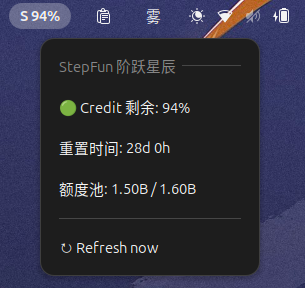

# StepFun Quota Indicator — GNOME Shell 扩展

在顶部面板显示 StepFun（阶跃星辰）开放平台 Step Plan 订阅的 Credit 额度剩余百分比，点击可查看重置时间和额度池。

## 功能

- **面板提示**：`S 99%`，剩余 <20% 变黄、<10% 变红
- **点击菜单**：Credit 剩余百分比、重置时间倒计时、额度池（residual / total），底部有刷新按钮
- **自动刷新**：每 25 分钟拉取一次（access token 30 分钟过期，提前刷）；连续失败按 2s → 5s → 15s → 30s 重试，之后回退 60s
- **网络**：StepFun API 国内直连，不走代理



## 依赖

- GNOME Shell ≥ 49
- 一个已登录 platform.stepfun.com 的浏览器（Chrome，用于首次导出 token）

## 安装

```bash
# 解压后进入目录
bash install.sh
```

然后重启 GNOME Shell（Alt+F2 → r → Enter），再启用：

```bash
gnome-extensions enable stepfun-quota@example.org
```

## 首次配置（导出 token）

浏览器登录 https://platform.stepfun.com 后，运行：

```bash
python3 stepfun-helper.py export
```

脚本通过 CDP 从 Chrome 读取 httpOnly Cookie `Oasis-Token`，并抓取 `RegisterDevice` 接口响应体里的 `refreshToken`，设备指纹 `Oasis-Webid` 也从 Cookie 一起写入，最终保存为 `~/.config/gnome-stepfun-quota/stepfun.json`：

```json
{
  "oasisToken": "<access JWT>",
  "refreshToken": "<refresh JWT>",
  "webid": "<设备指纹>"
}
```

配置文件权限 600，随你本机的账号（不要把这份文件分享给别人）。

之后扩展每次刷新自动轮换并写回 token，无需再开浏览器。

> ⚠ **不要与 gnome-kimi-quota 同时启用**：两个扩展共用同一个配置文件，同时开会互相顶掉对方轮换后的 refreshToken。

## 项目结构

```
gnome-stepfun-quota/
├── README.md         # 本文件
├── metadata.json     # 扩展元数据
├── extension.js      # 核心逻辑
├── stylesheet.css    # 面板标签样式
└── install.sh        # 安装脚本
```

## API（实测 2026-09）

Base：`https://platform.stepfun.com`，三个接口共用请求头：

```
Content-Type: application/json
oasis-appid: 10300
oasis-webid: <设备指纹>
oasis-platform: web
connect-protocol-version: 1
Referer/Origin: https://platform.stepfun.com
Cookie: Oasis-Token=<access token>; Oasis-Webid=<设备指纹>
```

| 接口 | 用途 |
|---|---|
| `POST /passport/proto.api.passport.v1.PassportService/RefreshToken` | 滚动刷新 access + refresh token |
| `POST /api/step.openapi.devcenter.Dashboard/QueryStepPlanRateLimit` | 查额度（`plan_credit_rate_limit`） |
| `POST /api/step.openapi.devcenter.Dashboard/QueryStepPlanUsages` | 查用量明细 |

### 鉴权要点（坑最多）

- access token 在 Cookie `Oasis-Token`（httpOnly，~30 分钟有效，JWT `mode=2`）
- 刷新必须**同时带一个当前有效的 access token**（放 Cookie），纯 refreshToken 自举不可行
- 响应里 `body.accessToken.raw` 是 `mode=1` 占位 token，**不能用**；新 access token 只在 `Set-Cookie: Oasis-Token=...` 里
- 服务端对过期 access token 也回 200，但给全套 mode=1（假成功）→ 必须解 JWT 验 `mode==2`
- refreshToken 每次刷新都轮换，必须持久化最新值（~30 天有效）
- access token 断链（超过 30 分钟没刷）→ 只能重新 `export`
